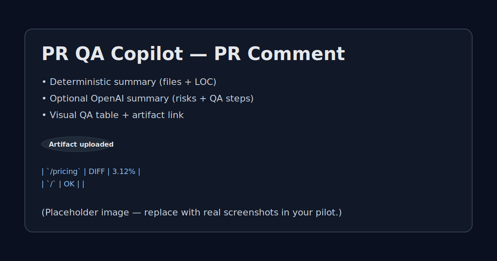
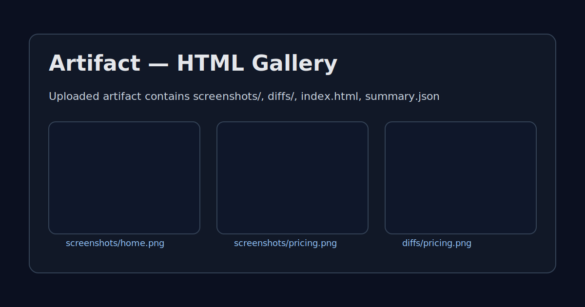
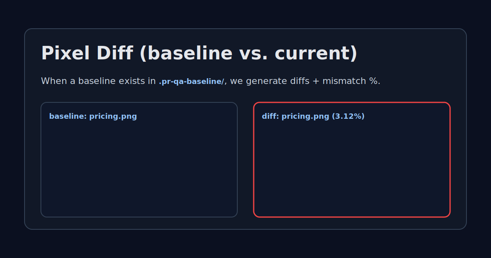

# PR QA Copilot (GitHub Action)

On every PR: post a **PR summary comment** + generate a **Playwright screenshot pack** (plus optional pixel diffs if you commit baselines).

Designed to be easy to pilot with dev shops: “every PR gets a review comment + a visual QA artifact automatically.”

| PR comment | Artifact gallery | Pixel diff |
|---|---|---|
|  |  |  |

Quick links:
- Landing (send to pilots): **[`docs/landing.md`](./docs/landing.md)**
- Install (5 minutes): **[`docs/install.md`](./docs/install.md)**

## What it does
- Creates/updates a single PR comment (idempotent) with:
  - deterministic PR summary (files changed + LOC)
  - optional OpenAI summary (risks + QA steps)
  - visual QA table (OK/DIFF/NEW_BASELINE/ERROR)
- Runs Playwright against a `base_url` + list of routes
- Uploads an artifact containing screenshots + a simple HTML gallery
- (Optional) generates pixel diffs if matching baselines exist in `.pr-qa-baseline/`

## Install / Usage
Create `.github/workflows/pr-qa-copilot.yml`:

```yml
name: PR QA Copilot

on:
  pull_request:
    types: [opened, synchronize, reopened]

permissions:
  contents: read
  pull-requests: write
  actions: write # required for artifact upload

jobs:
  pr-qa:
    runs-on: ubuntu-latest
    steps:
      - uses: actions/checkout@v4

      # Your pipeline should provide a preview URL (Vercel/Netlify/etc)
      # and pass it into base_url.
      - uses: ACHultman/pr-qa-copilot@v0
        with:
          github_token: ${{ secrets.GITHUB_TOKEN }}
          base_url: ${{ vars.PREVIEW_URL }}
          paths: |
            /
            /pricing
            /docs
          # Optional: enable Pro-only features (e.g., pixel diffs)
          license_key: ${{ secrets.PR_QA_LICENSE_KEY }}
```

### Inputs
| Input | Required | Default | Notes |
|---|---:|---|---|
| `github_token` | yes | — | Use `${{ secrets.GITHUB_TOKEN }}` |
| `base_url` | yes | — | Preview/staging URL to screenshot |
| `paths` | no | `/\n/build\n/results` | Newline-separated routes |
| `viewport` | no | `1280x720` | `WIDTHxHEIGHT` |
| `artifact_name` | no | `pr-qa-copilot` | Artifact name |
| `openai_api_key` | no | — | If set, generates enhanced PR summary |
| `openai_model` | no | `gpt-4o-mini` | Model used for summary |
| `max_diff_chars` | no | `12000` | PR diff truncation limit for LLM |
| `license_key` | no | — | Pro license key (enables gated features like pixel diffs) |
| `license_server_url` | no | `https://prqacopilot.com` | License server base URL for key validation |

Pro licensing setup (Stripe + validation endpoint): **[`docs/licensing.md`](./docs/licensing.md)**.

### Artifact contents
A workflow artifact (default name: `pr-qa-copilot`) containing:
- `screenshots/*.png`
- `diffs/*.png` (only when baseline exists)
- `index.html` (simple gallery)
- `summary.json`

## Visual baseline + diffs (optional)
Commit baseline screenshots to:

```
.pr-qa-baseline/<stem>.png
```

Mapping:
- route `/` → `home.png`
- route `/pricing` → `pricing.png`

See `.pr-qa-baseline/README.md`.

## Demo
### Option A — run the built-in self-demo workflow
This repo includes a workflow you can run via GitHub UI or CLI:

```bash
./scripts/demo.sh --base-url "https://example.com" --paths $'/\n/'
```

### Option B — use the PR trigger
Open/update a PR and the action runs automatically (see `.github/workflows/self-demo.yml`).

## Pilot onboarding (what we need)
If you’re piloting this on a customer repo, we typically need:
- repo access for **@ACHultman**
- a stable way to obtain the **preview URL** in CI (Vercel/Netlify/etc)
- a **route list** (start with 5–15)
- any **auth requirements** (test user, cookie/token injection strategy)

See: **[`docs/pilot-onboarding.md`](./docs/pilot-onboarding.md)**.

## Pricing (pilot)
Pilot pricing scales with team size:
- **$99/repo/mo** — small teams (≤ 10 engineers)
- **$149/repo/mo** — mid-size teams (11–40 engineers)
- **$249/repo/mo** — larger teams (41–100 engineers)
- includes **onboarding**
- includes **tuning + support** (routes, auth, timeouts/flakes)

## Pilot agreement (plain-English)
What we promise:
- Set up the action on 1 repo and get first successful run + artifact
- Iterate to reduce flakes (timeouts, waits) within the pilot scope
- Respond to pilot issues promptly (best-effort)

What you promise:
- Provide repo access + a preview/staging URL strategy
- Provide a route list and (if needed) test credentials
- Give feedback on usefulness and false positives

Cancelation:
- Month-to-month
- Cancel anytime; service ends at the end of the paid period

## Troubleshooting
- **Playwright timeouts / flaky pages**
  - Reduce route list to the top 5 pages and expand gradually
  - Prefer a stable staging/preview URL
  - Avoid routes with heavy animations; add small waits where needed
- **Missing env vars / inputs**
  - `base_url` and `github_token` are required inputs
  - OpenAI summary requires `openai_api_key` (GitHub Secret)
- **Artifact not uploaded**
  - Ensure workflow has permission to upload artifacts (default in GitHub-hosted runners)
  - Check Actions logs for `@actions/artifact` errors

## Roadmap
MVP → v1:
- Auto-route reviewers based on changed files
- Slack nudges / daily digest of PRs missing visual QA
- Smarter visual diffs (stable selectors, ignore regions, font/AA normalization)

## Contact
- Adam Hultman — **adam@achultman.com**
- Telegram — https://t.me/achultman

## License
MIT (see `LICENSE`).

## Contributing
See `CONTRIBUTING.md`.

## Changelog
See `CHANGELOG.md`.
