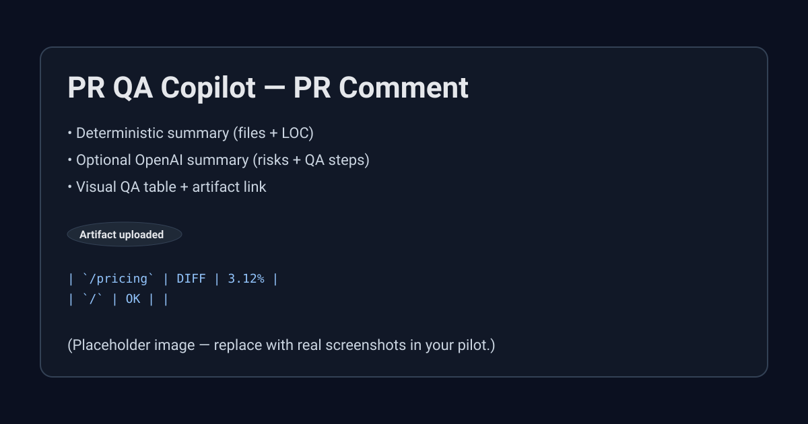
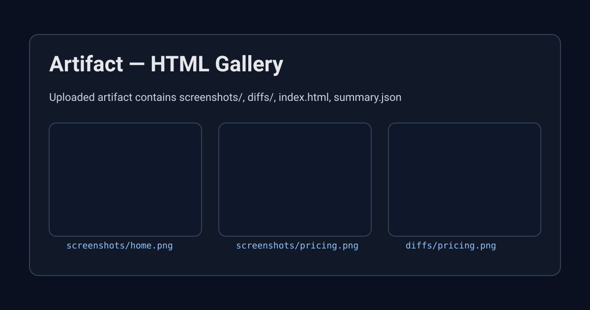
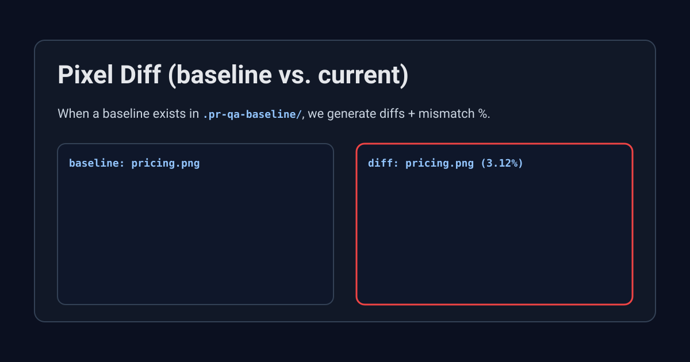

# PR QA Copilot (GitHub Action)

On every PR, find the successful preview deployment, catch runtime failures, exercise configured critical journeys, add static Next.js routes changed by the diff, and leave one QA report with screenshots and optional visual diffs.

Designed for product teams and agencies that want QA evidence before a human reviewer opens the preview.

| PR comment | Artifact gallery | Pixel diff |
|---|---|---|
|  |  |  |

Quick links:
- Product site: **[pr-qa-copilot.vercel.app](https://pr-qa-copilot.vercel.app)**
- Landing copy: **[`docs/landing.md`](./docs/landing.md)**
- Install (5 minutes): **[`docs/install.md`](./docs/install.md)**

## What it does
- Creates/updates a single PR comment (idempotent) with:
  - deterministic PR summary (files changed + LOC)
  - optional OpenAI summary (risks + QA steps)
  - route-level runtime and visual verdicts
- Detects static Next.js routes changed by the PR and adds them to your configured smoke-test paths
- Finds the successful GitHub deployment for the PR head commit and waits up to five minutes for its environment URL
- Executes declarative browser journeys for flows such as sign-in, checkout, and cancellation
- Captures uncaught page errors, console errors, failed same-origin requests, and same-origin HTTP 4xx/5xx responses
- Runs Playwright against the discovered preview URL or an explicit `base_url` override
- Uploads an artifact containing screenshots, issue details, JSON results, and an HTML gallery
- (Optional) generates pixel diffs if matching baselines exist in `.pr-qa-baseline/`
- Starts in reporting mode; set `fail_on_issues: true` when the signal is ready to gate merges

## Quick start
Create `.github/workflows/pr-qa-copilot.yml`:

```yml
name: PR QA Copilot

on:
  pull_request:
    types: [opened, synchronize, reopened]

permissions:
  contents: read
  deployments: read
  pull-requests: write
  actions: write # required for artifact upload

jobs:
  pr-qa:
    runs-on: ubuntu-latest
    steps:
      - uses: actions/checkout@v7

      - uses: ACHultman/pr-qa-copilot@v0
        with:
          github_token: ${{ secrets.GITHUB_TOKEN }}
          paths: |
            /
            /pricing
            /docs
          journey_file: .pr-qa-copilot/journeys.json
          auto_paths: true
          fail_on_issues: false
          # Optional: enable Pro-only features (e.g., pixel diffs)
          license_key: ${{ secrets.PR_QA_LICENSE_KEY }}
```

### Inputs
| Input | Required | Default | Notes |
|---|---:|---|---|
| `github_token` | yes | — | Use `${{ secrets.GITHUB_TOKEN }}` |
| `base_url` | no | auto | Explicit preview/staging URL override |
| `preview_wait_seconds` | no | `300` | Wait for a successful PR-head deployment; clamped to 0–900 |
| `vercel_protection_bypass` | no | — | Vercel Protection Bypass for Automation secret for protected previews |
| `paths` | no | `/` | Newline-separated routes |
| `journey_file` | no | — | JSON file containing critical browser journeys |
| `auto_paths` | no | `true` | Add static Next.js routes changed by the PR |
| `viewport` | no | `1280x720` | `WIDTHxHEIGHT` |
| `wait_after_load_ms` | no | `750` | Extra settle time before checks and screenshot |
| `ignore_console_patterns` | no | — | Newline-separated text or regex patterns for expected console errors |
| `fail_on_issues` | no | `false` | Fail after posting/uploading the report when runtime issues are found |
| `artifact_name` | no | `pr-qa-copilot` | Artifact name |
| `openai_api_key` | no | — | If set, generates enhanced PR summary |
| `openai_model` | no | `gpt-4o-mini` | Model used for summary |
| `max_diff_chars` | no | `12000` | PR diff truncation limit for LLM |
| `license_key` | no | — | Pro license key (enables gated features like pixel diffs) |
| `license_server_url` | no | `https://pr-qa-copilot.vercel.app` | License server base URL for key validation |

### Protected Vercel previews

Keep Vercel Authentication enabled and pass the project's [Protection Bypass for Automation](https://vercel.com/docs/deployment-protection/methods-to-bypass-deployment-protection/protection-bypass-automation) secret from GitHub Actions:

```yml
- uses: ACHultman/pr-qa-copilot@v0
  with:
    github_token: ${{ secrets.GITHUB_TOKEN }}
    vercel_protection_bypass: ${{ secrets.VERCEL_AUTOMATION_BYPASS_SECRET }}
```

The action masks the value and sends Vercel's documented bypass headers only to requests on the preview origin. If a protected preview redirects to Vercel Authentication without a valid bypass, the report returns an actionable error instead of testing the login wall.

### Critical journeys

Keep stable acceptance flows in the repository and point `journey_file` at the JSON file:

```json
{
  "journeys": [
    {
      "name": "Sign in and reach billing",
      "startPath": "/login",
      "steps": [
        { "action": "fill", "selector": "#email", "value": "${QA_EMAIL}" },
        { "action": "fill", "selector": "#password", "value": "${QA_PASSWORD}" },
        { "action": "click", "selector": "button[type=submit]" },
        { "action": "click", "selector": "a[href='/settings/billing']" },
        { "action": "expectText", "selector": "main", "value": "Current plan" },
        { "action": "expectUrl", "value": "/settings/billing" }
      ]
    }
  ]
}
```

Pass test credentials as step environment variables; `${NAME}` placeholders are resolved at runtime:

```yml
- uses: ACHultman/pr-qa-copilot@v0
  env:
    QA_EMAIL: ${{ secrets.PR_QA_TEST_EMAIL }}
    QA_PASSWORD: ${{ secrets.PR_QA_TEST_PASSWORD }}
  with:
    github_token: ${{ secrets.GITHUB_TOKEN }}
    journey_file: .pr-qa-copilot/journeys.json
```

Supported actions are `click`, `fill`, `check`, `select`, `press`, `waitFor`, `expectText`, and `expectUrl`. Use dedicated nonproduction accounts. A file may contain up to 10 journeys with 30 steps each.

Pro licensing setup (Stripe + validation endpoint): **[`docs/licensing.md`](./docs/licensing.md)**.

### Artifact contents
A workflow artifact (default name: `pr-qa-copilot`) containing:
- `screenshots/*.png`
- `diffs/*.png` (only when baseline exists)
- `journeys/*.png` (final state or failure state for each configured journey)
- `index.html` (simple gallery)
- `summary.json`

## Visual baseline + diffs (optional)
Commit baseline screenshots to:

```
.pr-qa-baseline/<stem>.png
```

Mapping:
- route `/` → `home.png`
- route `/pricing` → `pricing.png`

See `.pr-qa-baseline/README.md`.

## Demo
### Option A — run the built-in self-demo workflow
This repo includes a workflow you can run via GitHub UI or CLI:

```bash
./scripts/demo.sh --base-url "https://example.com" --paths $'/\n/'
```

### Option B — use the PR trigger
Open/update a PR and the action runs automatically (see `.github/workflows/self-demo.yml`).

## Pilot onboarding (what we need)
If you’re piloting this on a customer repo, we typically need:
- repo access for **@ACHultman**
- a GitHub Deployment with an environment URL, or an explicit **preview URL** override
- a **route list** (start with 5–15)
- any **auth requirements** (test user, cookie/token injection strategy)

See: **[`docs/pilot-onboarding.md`](./docs/pilot-onboarding.md)**.

## Pricing (paid pilot)
- **$399/month** for up to 3 repositories
- **$999/month** for agencies with up to 10 repositories
- includes onboarding, route selection, private-preview/auth setup, and signal tuning
- month to month

## Pilot agreement (plain-English)
What we promise:
- Set up the action on 1 repo and get first successful run + artifact
- Iterate to reduce flakes (timeouts, waits) within the pilot scope
- Respond to pilot issues promptly (best-effort)

What you promise:
- Provide repo access + a preview/staging URL strategy
- Provide a route list and (if needed) test credentials
- Give feedback on usefulness and false positives

Cancelation:
- Month-to-month
- Cancel anytime; service ends at the end of the paid period

## Troubleshooting
- **Playwright timeouts / flaky pages**
  - Reduce route list to the top 5 pages and expand gradually
  - Prefer a stable staging/preview URL
  - Avoid routes with heavy animations; add small waits where needed
- **Missing env vars / inputs**
  - `github_token` is required
  - If automatic discovery cannot find a successful GitHub Deployment, grant `deployments: read`, increase `preview_wait_seconds`, or pass `base_url`
  - If the preview redirects to Vercel Authentication, pass `vercel_protection_bypass` from a GitHub Actions secret
  - OpenAI summary requires `openai_api_key` (GitHub Secret)
- **Artifact not uploaded**
  - Ensure workflow has permission to upload artifacts (default in GitHub-hosted runners)
  - Check Actions logs for `@actions/artifact` errors

## Roadmap
- Diff-aware selection so only affected journeys run
- Stable selectors and visual ignore regions
- Managed GitHub App installation

## Contact
- Adam Hultman — **adam@hultman.dev**
- Telegram — https://t.me/achultman

## License
MIT (see `LICENSE`).

## Contributing
See `CONTRIBUTING.md`.

## Changelog
See `CHANGELOG.md`.
